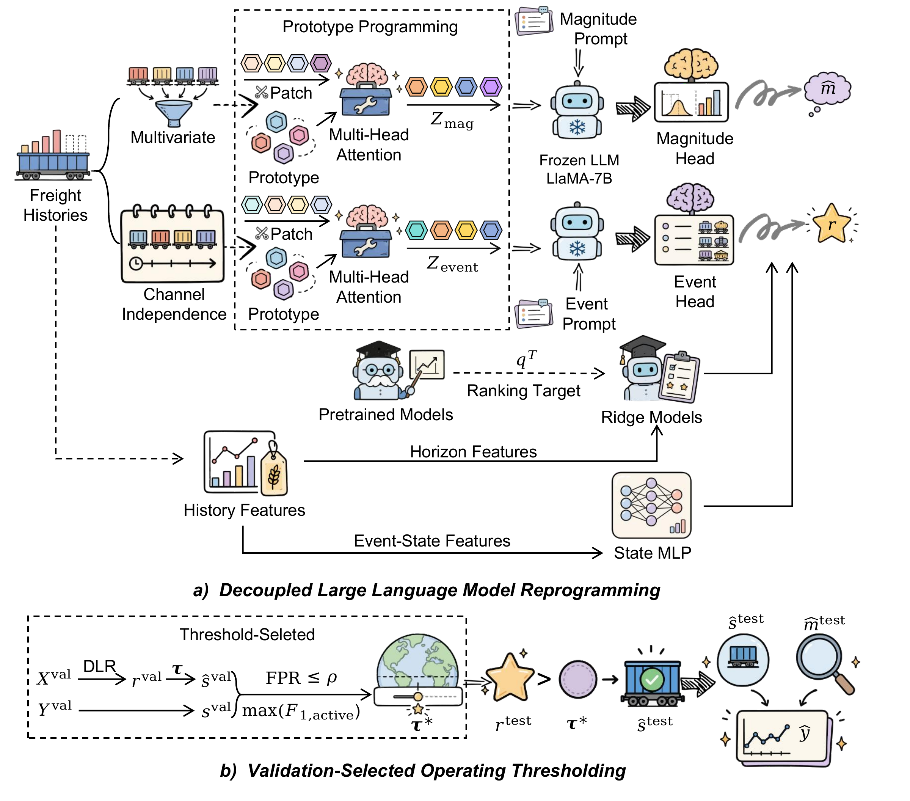

# DLR–VOT

This repository contains the code and experimental protocol for:

> *A Decoupled Large Language Model Reprogramming Framework with Validation-Selected Operating Thresholding for Sparse Railway Freight Forecasting*

DLR estimates freight magnitude and recorded activity in two separately trained streams. VOT selects an operating threshold on the validation set under a stated false positive rate budget. The selected threshold is fixed before the test set is evaluated, and the final rule either retains the candidate magnitude or assigns zero. This process is illustrated in the framework below.



*Figure 1. DLR–VOT framework: (a) decoupled LLM reprogramming; (b) validation-selected operating thresholding.* [View the original PDF](assets/figures/fig1-framework.pdf).

## What is included

- the DLR model, data loaders, losses, and evaluation code;
- a small, independent implementation of VOT;
- scripts that record the paper training and evaluation settings;
- the aggregate values reported in Tables 1–19;
- synthetic data and CPU tests that require no model download;
- data, model, and reproducibility notes.

The railway ledger, the completed daily table, pointwise predictions, and model checkpoints are not included. The data owner has not authorized their public release. The checkpoints are also too large for GitHub and contain language model weights supplied by a third party. See [DATA.md](DATA.md) and [REPRODUCIBILITY.md](REPRODUCIBILITY.md) for the exact boundary.

## Quick start

Python 3.11 was used for the reported experiments. A CPU smoke test only needs Python 3.10 or later.

```bash
python -m venv .venv
source .venv/bin/activate
python -m pip install --upgrade pip
python -m pip install -e '.[test]'
pytest -q
python scripts/verify_reference_tables.py
```

Generate a daily series with four channels and check its format:

```bash
python scripts/generate_synthetic_data.py \
  --daily-output /tmp/dlr_vot_daily.csv \
  --event-output /tmp/dlr_vot_validation.csv
python scripts/validate_daily_data.py /tmp/dlr_vot_daily.csv
```

VOT can be tested without the forecasting models. The input is a CSV containing validation scores and binary labels:

```bash
python scripts/select_vot.py /tmp/dlr_vot_validation.csv \
  --fpr-budget 0.11 \
  --output /tmp/dlr_vot_threshold.json
```

The decision rule is strict: an event is retained only when `score > threshold`.
The small CLI searches the unique validation scores. The paper reconstruction script uses the recorded grid of 90 validation quantiles together with fixed edge values.

## Reproducing the study

The release supports three distinct checks:

1. **CPU smoke test.** Generate synthetic data, validate the schema, and test threshold selection.
2. **Reported result check.** Verify the aggregate tables in `results/tables` and their checksums.
3. **Experimental rerun.** Train the magnitude and event streams, export validation and test outputs, generate teacher outputs from the training data, and run VOT. This requires authorized access to the completed daily railway table and separate access to the external backbones.

The first two checks use only public files. The third is documented but cannot reproduce the paper values from this repository alone because the railway observations and historical task checkpoints are restricted.

## Repository layout

```text
dlr_vot/                 Small VOT and data validation package
models/                  Forecasting and event stream models
layers/                  Neural network layers
data_provider*/          Chronological data loaders
scripts/                 Public commands and paper evaluation code
configs/                 Paper settings
results/tables/          Aggregate paper tables
tests/                   CPU tests with synthetic inputs
environments/            Training and teacher dependencies
```

## Models and data

The reported DLR runs used `huggyllama/llama-7b` through the Time-LLM interface. The exact historical model revision was not retained, so a new run should record the model revision and local file hashes. No language model weights are distributed here.

The recorded runs kept `prompt_domain=0`, so Time-LLM used its default dataset description. No description specific to railway freight was inserted into the model prefix.

The model input is a completed daily CSV with one date column and four nonnegative commodity columns. The loader applies a chronological 7:1:2 split and fits its scaler on the training portion only. It does not construct this table from the transaction ledger.

## Citation

Citation metadata are provided in [CITATION.cff](CITATION.cff). Until the paper has a final bibliographic record, please cite the manuscript title and this software release.

## Acknowledgements

The forecasting implementation extends [Time-LLM](https://github.com/KimMeen/Time-LLM), which in turn builds on the [Time-Series-Library](https://github.com/thuml/Time-Series-Library) and [One Fits All](https://github.com/DAMO-DI-ML/NeurIPS2023-One-Fits-All). Chronos-2 provides teacher outputs derived only from the training data. Code and model weights obtained from third parties remain subject to their own licenses. See [NOTICE](NOTICE).

## License

The source code in this release is provided under the Apache License 2.0 unless a file or dependency states otherwise.
